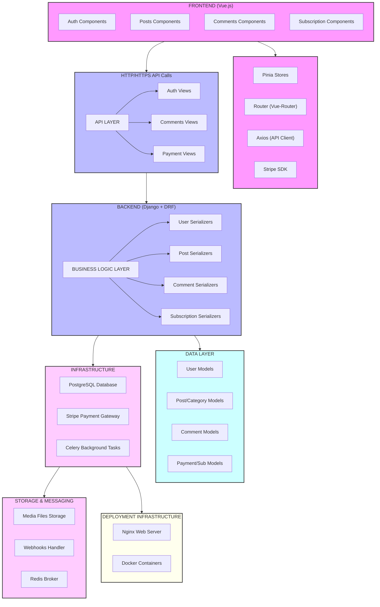

# Post+ - Блог-платформа с системой подписок

Проект разработан для закрепления практических навыков работы с Python и фреймворком Django. Фронтенд  на Vue.js генерировался с помощью LLM (85% кода было сгенерировано им), на основе подготовленного HTML-каркаса. В дальнейшем я дорабатывал и исправлял баги самостоятельно. В бэкенде нейросеть использовалась для ускорения создания моделей на основе промптов, после чего я дорабатывал и адаптировал результат. Интеграция с платежной системой Stripe реализована в **тестовом режиме**. Все сценарии (оплата, вебхуки, управление подписками) работают также как и при реальной интеграции оплаты.

  

## 🚀 Основные возможности

  
### Для пользователей

- **Регистрация и аутентификация** - JWT-токены, обновление токенов

- **Управление профилем** - редактирование данных, смена пароля

- **Создание и управление постами** - WYSIWYG редактор

- **Система комментариев** - многоуровневые комментарии с ответами

- **Категоризация постов** - организация контента по тематикам

- **Поиск и фильтрация** - быстрый поиск по постам и комментариям

  

### Премиум функции (подписка)

- **Закрепление постов** - выделение важного контента в топе

- **Приоритетный показ** - закрепленные посты отображаются первыми

- **Статистика** - детальная аналитика для авторов

  

### Административные возможности

- **Модерация контента** - управление постами и комментариями

- **Аналитика платежей** - отчеты по доходам и подпискам

- **Управление пользователями** - права доступа и роли

- **Webhook обработка** - автоматическая синхронизация с Stripe

  

## 🛠 Технологический стек

  

### Backend

- **Django 5.2** - основной веб-фреймворк

- **Django REST Framework** - API интерфейсы

- **PostgreSQL** - основная база данных

- **Redis** - кеширование и очереди задач

- **Celery** - асинхронные задачи

- **Stripe API** - платежная система

  

### Frontend

- **Vue.js 3** - современный фронтенд фреймворк

- **Pinia** - управление состоянием

- **Vue Router** - маршрутизация

- **Tailwind CSS** - стилизация

- **Axios** - HTTP клиент

  

### DevOps

- **Docker & Docker Compose** - контейнеризация

- **Nginx** - reverse proxy и статические файлы

- **Let's Encrypt** - SSL сертификаты

- **Gunicorn** - WSGI сервер

  

## 📋 Структура проекта

  

```

news-site/

├── backend/ # Django приложение

│ ├── apps/

│ │ ├── accounts/ # Пользователи и аутентификация

│ │ ├── main/ # Посты и категории

│ │ ├── comments/ # Система комментариев

│ │ ├── subscribe/ # Подписки и премиум функции

│ │ └── payment/ # Платежная система

│ ├── config/ # Настройки Django

│ └── manage.py

├── frontend/ # Vue.js приложение

│ ├── src/

│ │ ├── components/ # Переиспользуемые компоненты

│ │ ├── views/ # Страницы приложения

│ │ ├── stores/ # Pinia хранилища

│ │ ├── router/ # Маршрутизация

│ │ └── services/ # API клиенты

│ └── package.json

├── docker-compose.yml # Оркестрация контейнеров

├── nginx.conf # Конфигурация веб-сервера

└── .env # Переменные окружения

```

  

## 🎯 Основные модели данных

  

### User (Пользователи)

- Расширенная модель пользователя Django

- Поддержка аватаров и биографии

- JWT аутентификация

  

### Post (Посты)

- Заголовок, контент, изображения

- Система статусов (черновик/опубликован)

- Счетчики просмотров и комментариев

- SEO-friendly URL (slug)

  

### Comment (Комментарии)

- Многоуровневая система ответов

- Мягкое удаление (софт-делит)

- Модерация и управление

  

### Subscription (Подписки)

- Тарифные планы с различными возможностями

- Автоматическое продление

- Интеграция со Stripe

  

### Payment (Платежи)

- Полная история транзакций

- Webhook обработка от Stripe

- Система возвратов

  

## 🔧 API Endpoints

  

### Аутентификация

```

POST /api/v1/auth/register/ # Регистрация

POST /api/v1/auth/login/ # Вход

POST /api/v1/auth/logout/ # Выход

GET /api/v1/auth/profile/ # Профиль пользователя

PUT /api/v1/auth/profile/ # Обновление профиля

POST /api/v1/auth/token/refresh/ # Обновление токена

```

  

### Посты и категории

```

GET /api/v1/posts/ # Список постов

POST /api/v1/posts/ # Создание поста

GET /api/v1/posts/{slug}/ # Детали поста

PUT /api/v1/posts/{slug}/ # Обновление поста

GET /api/v1/posts/popular/ # Популярные посты

GET /api/v1/posts/categories/ # Категории

```

  

### Комментарии

```

GET /api/v1/comments/ # Все комментарии

POST /api/v1/comments/ # Создание комментария

GET /api/v1/comments/post/{id}/ # Комментарии к посту

GET /api/v1/comments/{id}/replies/ # Ответы на комментарий

```

  

### Подписки и платежи

```

GET /api/v1/subscribe/plans/ # Тарифные планы

GET /api/v1/subscribe/status/ # Статус подписки

POST /api/v1/subscribe/pin-post/ # Закрепление поста

POST /api/v1/payment/create-checkout-session/ # Создание сессии оплаты

```

  

## 🌟 Особенности архитектуры

  

### Система закрепленных постов

- Только подписчики могут закреплять посты

- Автоматическая проверка активности подписки

- Умная сортировка в ленте новостей

  

### Платежная интеграция

- Stripe Checkout для безопасных платежей

- Webhook обработка для синхронизации статусов

- Система повторных попыток для неудачных платежей

  

### Производительность

- Кеширование часто запрашиваемых данных

- Пагинация всех списков

- Оптимизированные SQL запросы с select_related

  

### Безопасность

- JWT токены с автообновлением

- CORS настройки для кросс-доменных запросов

- Rate limiting для API endpoints

- Валидация и санитизация пользовательского ввода

  

## 💾 База данных

  

Проект использует PostgreSQL с следующими основными таблицами:

- `users` - пользователи

- `posts` - посты блога

- `categories` - категории постов

- `comments` - комментарии

- `subscriptions` - подписки пользователей

- `subscription_plans` - тарифные планы

- `payments` - платежи

- `pinned_posts` - закрепленные посты

  

## 🔄 Асинхронные задачи (Celery)

  

- **Проверка истекших подписок** - ежечасно

- **Отправка напоминаний о продлении** - ежедневно

- **Очистка старых платежей** - еженедельно

- **Обработка webhook событий** - по требованию

- **Генерация отчетов** - по расписанию

  

## 🚀 Развертывание

  

### Требования

- Docker и Docker Compose

- Домен с SSL сертификатом

- Stripe аккаунт для платежей
  

### Конфигурация Nginx

- Автоматическое перенаправление HTTP → HTTPS

- Сжатие статических файлов

- Кеширование изображений и медиа

- Rate limiting для API

- Проксирование к Django и Vue.js сервисам

  

## 📊 Мониторинг и логирование

  
- Nginx access и error логи

- Django логирование всех операций

- Celery логи для асинхронных задач

- Stripe webhook логи для отладки платежей


